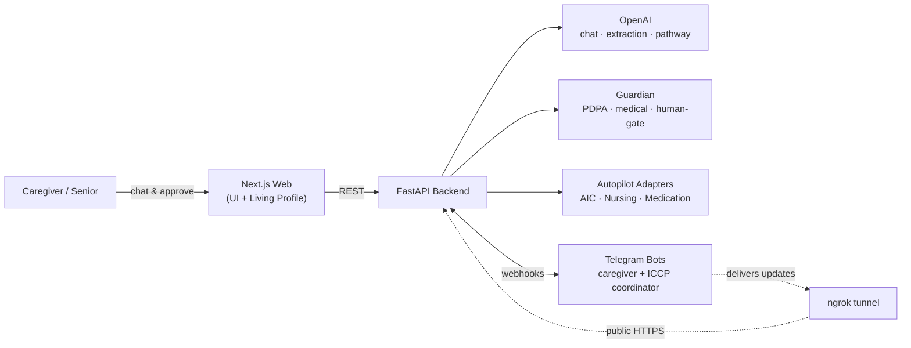

<div align="center">

# CareKaki

### Your care buddy that knows where to start.

**An AI care navigator that turns the overwhelming maze of Singapore's community-care system into one clear, personalised, act-on-it-today plan — then runs the legwork for you.**

[](https://nextjs.org)
[](https://react.dev)
[](https://fastapi.tiangolo.com)
[](https://tailwindcss.com)
[](https://www.docker.com)

*Built for Dell InnovateDash.*

</div>

---

## The problem

When a loved one falls, gets discharged, or simply starts needing more help, families in Singapore hit a wall: *Who do I even call?* Eldercare schemes, home-nursing providers, CHAS clinics, ICCP coordinators, grants, medication reviews — the support exists, but it's scattered across dozens of agencies and acronyms. The hardest part of caregiving isn't the caring. It's knowing **where to start**.

## The solution

**CareKaki** ("kaki" = *buddy* in Singlish) is a conversational AI navigator. You tell it your situation in plain language; it assembles a **living care profile**, generates a **personalised care pathway**, and — with your approval — dispatches a fleet of agents (**Autopilot**) to do the actual coordination: alerting caregivers, booking nursing, surfacing eldercare services, running medication-safety checks, and handing the case over to a human coordinator.

Every AI output passes through **Guardian**, a Responsible-AI layer that redacts personal data (PDPA), blocks medical advice, and gates risky actions behind human approval.

---

## The experience

```
  Landing ──▶ Onboard ──▶ Chat ──▶ Living Care Profile ──▶ Pathway ──▶ Consent ──▶ Autopilot ──▶ Handover
   pick a      seed the    build the    fields fill in       4-stage     care      agents run     to a human
   mode        profile     profile      as you talk          plan        brief     in parallel    coordinator
```

- **Two modes** — *"For myself"* or *"For someone I care for"*. Everything after adapts to your answer.
- **Conversational profiling** — a short, empathetic chat extracts living situation, mobility, conditions, caregiver capacity, and financial tier.
- **Living Care Profile** — fields light up in real time as the conversation reveals them, marked as MyInfo-verified or chat-assembled.
- **Personalised Pathway** — a 4-column plan (`This Week` → `Weeks 2–8` → `Apply Now` → `Single Point of Contact`), where every item traces back to a fact about *you*.
- **Autopilot** — approve the plan and watch 5 agents execute simultaneously in a live "machine-world" dashboard, wrapped end-to-end by Guardian.

---

## Autopilot agents

| Agent | What it does | Data / channel |
|-------|--------------|----------------|
| 🟠 **Caregiver Alert** | Pushes emergency alerts with one-tap response buttons (*I'm going now · Call ambulance · Ask neighbor · Escalate*) | Telegram |
| 🔵 **ICCP Coordinator** | Assembles a case packet and hands it over to a care coordinator for accept / escalate | Telegram |
| 🟢 **AIC Eldercare** | Recommends nearest eldercare services & activity centres | Real SG open data (geojson) |
| 🟣 **HomeNursing.sg** | Searches nearby nursing providers and drafts a tentative booking | Provider directory |
| 🟡 **Medication Review** | Extracts medications, looks up HSA + openFDA data, flags risks, routes to a pharmacy desk | HSA registry + openFDA |

## Guardian — the Responsible-AI layer

Every agent output is filtered before it reaches a human:

- **PDPA redaction** — masks Singapore NRICs, phone numbers, and emails.
- **No-medical-advice classifier** — detects dosage/diagnosis/prescription language and appends a disclaimer.
- **Human gate** — risky actions (*submit, book, apply, escalate, call 995, handover…*) require explicit caregiver/supervisor approval.
- **Traceability** — every decision is tagged with its adapter and data sources.

---

## Architecture



The backend degrades gracefully: **with no API keys at all it still boots** and serves synthetic/demo data — Guardian, health, and the rule-based emergency/adapter routing all work offline. LLM replies and live Telegram simply switch off.

## Tech stack

| Layer | Tech |
|-------|------|
| **Frontend** | Next.js 16 · React 19 · TypeScript · Tailwind CSS v4 · Leaflet / react-leaflet |
| **Backend** | FastAPI · Python 3.11 · Pydantic · OpenAI (`gpt-4o-mini`) · pandas |
| **Messaging** | Telegram Bot API (caregiver + ICCP coordinator bots) |
| **Infra** | Docker Compose · ngrok (webhook tunnel) |
| **Data** | CHAS Clinics · Eldercare Services (geojson) · HSA Registered Therapeutic Products · openFDA |

---

## Getting started

### Option A — local dev

```bash
# 1. Frontend (repo root)
npm install
npm run dev                       # → http://localhost:3000

# 2. Backend (in another terminal)
cd backend
pip install -r requirements.txt
cp .env.example .env              # fill in keys (all optional)
uvicorn main:app --reload --port 8000   # → http://localhost:8000
```

Open [http://localhost:3000](http://localhost:3000) and pick a mode to begin.

### Option B — Docker (recommended)

Copy `.env.example` to `.env` in the repo root and fill in any keys you have (all are optional — the stack boots on synthetic data when blank), then:

```bash
docker compose up --build
```

- Web → http://localhost:3000
- Backend → http://localhost:8000

---

## Live Telegram bots (auto ngrok + webhook)

The Telegram webhooks need a public HTTPS URL pointing at the backend. The `webhook` compose profile starts an [ngrok](https://ngrok.com) tunnel, and the backend **automatically registers** both bots' webhooks (`/telegram/webhook` and `/iccp/webhook`) on startup — no manual `setWebhook` / "connect link" step.

1. In the root `.env`, set:
   - `NGROK_AUTHTOKEN` — from the [ngrok dashboard](https://dashboard.ngrok.com/get-started/your-authtoken)
   - `NGROK_DOMAIN` — a reserved [static domain](https://dashboard.ngrok.com/domains), host only (e.g. `your-domain.ngrok-free.dev`)
   - `PUBLIC_BASE_URL` — the full URL, e.g. `https://your-domain.ngrok-free.dev`
   - plus `TELEGRAM_BOT_TOKEN` / `ICCP_BOT_TELEGRAM_TOKEN`
2. Start everything (web + backend + ngrok):

```bash
docker compose --profile webhook up --build
```

The ngrok request inspector lives at http://localhost:4040. Verify Telegram can reach the backend:

```bash
curl -s "https://api.telegram.org/bot<TELEGRAM_BOT_TOKEN>/getWebhookInfo" | python3 -m json.tool
# expect "pending_update_count": 0 and no "last_error_message"
```

In Telegram, send `/start` to the caregiver bot and `/coordinator` in your ICCP group to register the channels.

---

## Project structure

```
CareKaki-repo/
├── app/                  # Next.js routes (landing, onboard, chat, pathway, autopilot, handover…)
├── components/           # UI: chat, pathway board, autopilot feeds, Guardian band
├── hooks/                # useChatState — talks to the backend
├── lib/                  # shared types, session, demo users
├── backend/
│   ├── main.py           # FastAPI app: chat, pathway, autopilot, Telegram webhooks
│   ├── services/         # guardian + AIC / nursing / medication adapters
│   ├── data/             # CHAS clinics, eldercare services, HSA registry
│   └── tests/            # pytest suite
├── docker-compose.yml    # web + backend (+ ngrok via --profile webhook)
└── .env.example          # root env for Docker
```

## Tests

```bash
cd backend
pytest
```

Tests cover routing and response logic (Guardian, adapters, API). Telegram send functions are mocked, so they verify behaviour — not infrastructure like the ngrok tunnel being live.

---

## Data sources

Built on Singapore open data: **CHAS Clinics**, **Eldercare Services**, and the **HSA Listing of Registered Therapeutic Products**, enriched with **openFDA**. Demo data is synthetic — no real patient information.

## Disclaimer

CareKaki is a prototype and **does not provide medical advice**. Always consult a qualified healthcare professional for clinical guidance.
