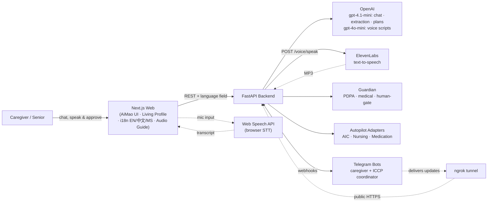

<div align="center">

# CareKaki

### Your care buddy that knows where to start.

**An AI care navigator that turns the overwhelming maze of Singapore's community-care system into one clear, personalised, act-on-it-today plan — then runs the legwork for you. Fronted by AiMao, a friendly panda care companion, in English, 中文, and Bahasa Melayu.**

[](https://github.com/stormragemc/CareKaki-repo/actions/workflows/ci.yml)
[](https://nextjs.org)
[](https://react.dev)
[](https://fastapi.tiangolo.com)
[](https://tailwindcss.com)
[](https://www.docker.com)

*Built for Dell InnovateDash.*

</div>

---

## The problem

When a loved one falls, gets discharged, or simply starts needing more help, families in Singapore hit a wall: *Who do I even call?* Eldercare schemes, home-nursing providers, CHAS clinics, ICCP coordinators, grants, medication reviews — the support exists, but it's scattered across dozens of agencies and acronyms. The hardest part of caregiving isn't the caring. It's knowing **where to start**.

## The solution

**CareKaki** ("kaki" = *buddy* in Singlish) is a conversational AI navigator. You tell it your situation in plain language; it assembles a **living care profile**, generates a **personalised Care Plan**, and — with your approval — quietly dispatches a fleet of agents to do the actual coordination: alerting caregivers, booking nursing, surfacing eldercare services, running medication-safety checks, and handing the case over to a human coordinator.

The face of all this is **AiMao**, a warm panda care companion (a physical robot concept — the web app is the software that would live on AiMao's screen-face). *AiMao is the face. CareKaki is the intelligence underneath.* The UI is deliberately senior-friendly: large, rounded, conversational, and never clinical.

Every AI output passes through **Guardian**, a Responsible-AI layer that redacts personal data (PDPA), blocks medical advice, and gates risky actions behind human approval.

---

## The experience

```
 Home ──▶ Onboard / Sign in ──▶ Consent ──▶ Tutorial ──▶ Chat ──▶ Care Plan ──▶ AiMao arranges ──▶ Care Brief ─┐
 meet      pick a mode or a      Singpass/    how it      talk to    plan built     agents run        warm        │
 AiMao     demo profile          MyInfo       works       AiMao      from *you*     behind the scenes handover    │
                                                            ▲                                                     │
                                                            └────────────── the care cycle repeats ◀──────────────┘
```

- **Two modes** — *"For myself"* or *"For someone I care for"*. Everything after adapts to your answer. Returning users pick a demo profile from a Netflix-style **sign-in** screen (four personas: Mdm Tan, Mr Lim, Mrs Wong, Uncle Raj — each seeding a different scenario and agent mix).
- **Conversational profiling** — a short, empathetic chat with AiMao extracts living situation, mobility, conditions, caregiver capacity, and financial tier.
- **Living Care Profile** — fields light up in real time as the conversation reveals them, marked as MyInfo-verified or chat-assembled.
- **Care Plan** — a personalised board (`This Week` → `Weeks 2–8` → `Apply Now` → a single point of contact), where every item traces back to a fact about *you*. Editable by talking to AiMao — plain-language edits are applied by the LLM.
- **AiMao arranges** — approve the plan and agents execute simultaneously, wrapped end-to-end by Guardian. The live "machine-world" dashboard still exists as **AiMao's Mind**, an expert view tucked behind a brain icon — normal users never need it.
- **Care Brief** — a printable warm-handover summary (situation, cadence, actions, consents on file) with hand-rolled SVG charts of the week.
- **The care cycle** — Care Plan → AiMao arranges → Care Brief → next Care Plan. Each phase carries vital context plus a short "what happened" summary forward.
- **Audio Guide** — optional voice layer: ElevenLabs narrates each step in a warm, human tone; the mic button lets you speak instead of type.

---

## Three languages

The whole journey runs in **English**, **中文 (Simplified Chinese)**, and **Bahasa Melayu** — switchable from the header at any time.

- **UI strings** live in `lib/i18n.ts`; localized care-plan content in `lib/careData.zh.ts` / `lib/careData.ms.ts`.
- **LLM output** (chat replies, plan edits, voice scripts) is localized by the backend via a `language` field on each request — brand and scheme names (AiMao, CareKaki, Guardian, CHAS, MediFund, SingPass, ICCP) always stay in English.
- **Speech** follows suit: mic recognition and narration use per-language locales (`en-SG`, `zh-CN`, `ms-MY`).

## Audio Guide — voice layer

CareKaki includes an optional **Audio Guide** that turns the journey into a spoken walkthrough. Toggle it from the header on any page.

| Direction | Technology | What it does |
|-----------|------------|--------------|
| **Output (TTS)** | ElevenLabs (`eleven_multilingual_v2`) | Backend generates a short script via GPT-4o-mini, converts it to MP3, and the frontend plays it with Speaking / Listening / Ready status — AiMao's face animates along |
| **Input (STT)** | Web Speech API (browser-native) | Mic captures speech and routes it to the current page — chat messages, care-plan edits, approval ("go ahead"), or care-brief questions |

The voice **narrates what CareKaki is already doing** — it never makes independent decisions or calls adapters directly. Page events (plan created, autopilot ready, profile updated, etc.) trigger contextual narration via `POST /voice/speak`. Mic input auto-mutes while the AI is speaking; route changes stop all audio.

Set `ELEVENLABS_API_KEY` and `ELEVENLABS_VOICE_ID` in `.env` for spoken output. Without them, the guide still generates scripts but stays silent.

---

## The agents behind "AiMao arranges"

| Agent | What it does | Data / channel |
|-------|--------------|----------------|
| 🟠 **Caregiver Alert** | Pushes emergency alerts with one-tap response buttons (*I'm going now · Call ambulance · Ask neighbor · Escalate*) | Telegram |
| 🔵 **ICCP Coordinator** | Assembles a case packet and hands it over to a care coordinator for accept / escalate | Telegram |
| 🟢 **AIC Eldercare** | Recommends nearest eldercare services & activity centres | Real SG open data (geojson) |
| 🟣 **HomeNursing.sg** | Searches nearby nursing providers and drafts a tentative booking | Provider directory |
| 🟡 **Medication Review** | Extracts medications, looks up HSA + openFDA data, flags risks, routes to a pharmacy desk | HSA registry + openFDA |

Watch them run live in **AiMao's Mind** (`/autopilot`) — the expert view behind the brain icon in the header.

## Guardian — the Responsible-AI layer

Every agent output is filtered before it reaches a human:

- **PDPA redaction** — masks Singapore NRICs, phone numbers, and emails.
- **No-medical-advice classifier** — detects dosage/diagnosis/prescription language and appends a disclaimer.
- **Human gate** — risky actions (*submit, book, apply, escalate, call 995, handover…*) require explicit caregiver/supervisor approval.
- **Traceability** — every decision is tagged with its adapter and data sources.

---

## Architecture



The backend degrades gracefully: **with no API keys at all it still boots** and serves synthetic/demo data — Guardian, health, and the rule-based emergency/adapter routing all work offline. LLM replies, live Telegram, and ElevenLabs audio simply switch off (Audio Guide falls back to script-only or silent).

## Tech stack

| Layer | Tech |
|-------|------|
| **Frontend** | Next.js 16 · React 19 · TypeScript · Tailwind CSS v4 (CSS-first, no config file) · lucide-react · Leaflet / react-leaflet · hand-rolled SVG charts |
| **i18n** | English · 简体中文 · Bahasa Melayu — `lib/i18n.ts` + localized LLM output via a per-request `language` field |
| **Backend** | FastAPI · Python 3.11 · Pydantic · OpenAI (`gpt-4.1-mini` chat/extraction/plans, `gpt-4o-mini` voice scripts) · pandas |
| **Voice** | ElevenLabs (text-to-speech) · Web Speech API (browser speech-to-text) |
| **Messaging** | Telegram Bot API (caregiver + ICCP coordinator bots) |
| **Infra** | Docker Compose · ngrok (webhook tunnel) · GitHub Actions CI |
| **Data** | CHAS Clinics · Eldercare Services (geojson) · HSA Registered Therapeutic Products · openFDA |

---

## Getting started

### Option A — local dev

```bash
# 1. Frontend (repo root)
npm install
npm run dev                       # → http://localhost:3000

# 2. Backend (in another terminal)
cd backend
pip install -r requirements.txt
cp .env.example .env              # fill in keys (all optional)
uvicorn main:app --reload --port 8000   # → http://localhost:8000
```

Optional keys for full functionality: `OPENAI_API_KEY` (chat/plans), `ELEVENLABS_API_KEY` + `ELEVENLABS_VOICE_ID` (Audio Guide narration), `TELEGRAM_BOT_TOKEN` / `ICCP_BOT_TELEGRAM_TOKEN` (live bots), `OPENFDA_API_TOKEN` (medication lookups).

Open [http://localhost:3000](http://localhost:3000), meet AiMao, and pick a mode to begin (or **Sign in** to jump into a demo persona). Switch language from the header at any time; enable **Audio Guide** to hear step-by-step narration and use the mic to speak instead of type.

### Option B — Docker (recommended)

Copy `.env.example` to `.env` in the repo root and fill in any keys you have (all are optional — the stack boots on synthetic data when blank), then:

```bash
docker compose up --build
```

- Web → http://localhost:3000
- Backend → http://localhost:8000

---

## Live Telegram bots (auto ngrok + webhook)

The Telegram webhooks need a public HTTPS URL pointing at the backend. The `webhook` compose profile starts an [ngrok](https://ngrok.com) tunnel, and the backend **automatically registers** both bots' webhooks (`/telegram/webhook` and `/iccp/webhook`) on startup — no manual `setWebhook` / "connect link" step.

1. In the root `.env`, set:
   - `NGROK_AUTHTOKEN` — from the [ngrok dashboard](https://dashboard.ngrok.com/get-started/your-authtoken)
   - `NGROK_DOMAIN` — a reserved [static domain](https://dashboard.ngrok.com/domains), host only (e.g. `your-domain.ngrok-free.dev`)
   - `PUBLIC_BASE_URL` — the full URL, e.g. `https://your-domain.ngrok-free.dev`
   - plus `TELEGRAM_BOT_TOKEN` / `ICCP_BOT_TELEGRAM_TOKEN`
2. Start everything (web + backend + ngrok):

```bash
docker compose --profile webhook up --build
```

The ngrok request inspector lives at http://localhost:4040. Verify Telegram can reach the backend:

```bash
curl -s "https://api.telegram.org/bot<TELEGRAM_BOT_TOKEN>/getWebhookInfo" | python3 -m json.tool
# expect "pending_update_count": 0 and no "last_error_message"
```

In Telegram, send `/start` to the caregiver bot and `/coordinator` in your ICCP group to register the channels.

---

## Project structure

```
CareKaki-repo/
├── app/
│   ├── (main)/           # Home (AiMao companion), chat, pathway (Care Plan)
│   ├── autopilot/        # AiMao's Mind — expert view of the running agents
│   ├── handover/         # Care Brief — printable warm-handover summary
│   ├── onboard/ consent/ tutorial/ login/   # first-run journey + demo sign-in
├── components/
│   ├── aimao/            # the panda: character, live face, speech bubble, Ask-AiMao
│   ├── chat/ pathway/ careplan/ autopilot/  # feature UI (plan board, brief, agent feeds)
│   ├── ui/               # GuardianBand, FlowStepper, LanguageSwitch, AudioGuide…
│   └── layout/Header.tsx # nav: Home · Care Plan · Care Brief (+ brain icon)
├── contexts/             # AudioGuideContext (voice state + mic routing), LanguageContext
├── hooks/                # useChatState, useAudioGuide, useVoiceEvent
├── lib/                  # i18n.ts, careData(.zh/.ms).ts, care-cycle, demo users, types
├── backend/
│   ├── main.py           # FastAPI app: chat, pathway, autopilot, care brief, voice, Telegram
│   ├── services/         # guardian, voice_guide, AIC / nursing / medication adapters
│   ├── data/             # CHAS clinics, eldercare services, HSA registry
│   └── tests/            # pytest suite (208 tests, fully offline)
├── .github/workflows/ci.yml   # frontend · backend · docker jobs
├── docker-compose.yml    # web + backend (+ ngrok via --profile webhook)
└── .env.example          # root env for Docker (incl. ElevenLabs keys)
```

## Tests & CI

```bash
cd backend
pytest          # 208 tests, no API keys needed — the suite runs fully offline
```

Tests cover routing and response logic (Guardian, adapters, API). Telegram send functions are mocked, so they verify behaviour — not infrastructure like the ngrok tunnel being live.

Every push runs three independent GitHub Actions jobs: **frontend** (ESLint · TypeScript typecheck · production build), **backend** (the offline pytest suite), and **docker** (builds both images and boots the full compose stack until healthchecks pass — exactly what the demo runs on).

---

## Data sources

Built on Singapore open data: **CHAS Clinics**, **Eldercare Services**, and the **HSA Listing of Registered Therapeutic Products**, enriched with **openFDA**. Demo data is synthetic — no real patient information.

## Disclaimer

CareKaki is a prototype and **does not provide medical advice**. Always consult a qualified healthcare professional for clinical guidance.
